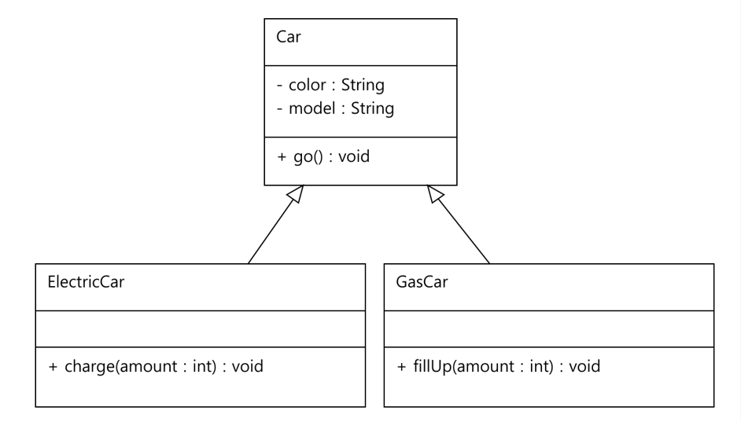
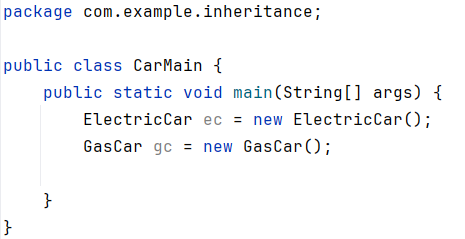
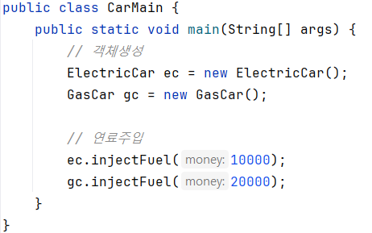
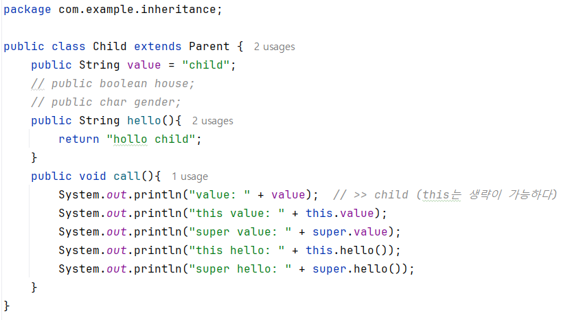

# 상속
## inheritance package 만들기
### ElectricCar, GasCar 클래스 작성 
#### 클래스에는 멤버변수, 메소드가 존재 
- ElectricCar: go(), charge()
- GasCar: go(), fillUp()
> 주행하다 go()는 공통이고, 연료를 주입하다 charge(), fillUP()는 방법이 다르다. 
> 좀 더 추상적인 Car class를 만들고 공통요소인 go() 가지면 된다.
#### class ElectricCar extends Car{...}
- 자바는 단일 상속만 허용한다. 
- 부모 클래스 (super class)
- 자식 클래스 (sub class)
- 상속 키워드는 extends의 대상은 하나이다.(단일 상속)
- 자식은 부모가 누구인지 알지만 부모는 자식을 모른다.
- interface는 다중구현을 허용한다.
#### 상속과 메모리 구조
- 상속 관계의 객체를 생성하면 부모와 자식의 공간이 구분되어 생성
- 현재 타입(child)에서 기능(method)를 찾지 못하면 상위 부모 타입에서 기능을 찾아 실행
>  
>  
- new ElectricCar()를 호출하면 상속관계에 있는 Car까지 포함해서 instance생성한다.
- 부모의 instance가 먼저 생성하고, 본인(자식)의 instance가 생성된다.
- 부모와 자식의 공간이 구분되어 생성한다.(생성자가 따로 생성) 
>  
> ec.injectFuel()을 호출할 때, 자신에게 있는 메소드면 자신의 것을 실행하고, 
> 자신에게 없고 부모에게 있는 메소드면 부모의 것을 실행한다. 
> 둘 다 없다면 컴파일 에러가 발생한다.
> ##### 상속은 새로운 자동차로 확장(extends)할 수 있다.
> ##### 부모에 기능을 추가하면 자식들은 그 기능을 활용 할 수 있다.
#### method override
- 자식이 새롭게 메소드를 <b>재정의</b> 한다.(상속관계에서 부모의 기능을 자식이 덮어쓴다.)
#### method override 조건
- 부모 메소드와 이름, return 타입 뿐만 아니라 매개변수의 타입, 순서, 개수가 같아야 한다. 
- 접근제어자는 부모클래스의 메소드보다 자식이 더 넓은 범위를 가져야 한다. 
- static(클래스 레벨), final(메소드 수정불가), private(외부 노출 없음) 메소드는 overriding 할 수 없다.
- 생성자는 overriding 할 수 없다.
#### 접근제어자(UML표기) 종류
- private( - ) : 모든 외부 호출을 막는다.
- default( ~ ) : 같은 패키지 안에서 호출이 허용된다.
- protected( # ) : 같은 패키지 안에서 호출이 허용된다. 단, 패키지가 달라도 상속관계라면 호출이 가능하다.
- public( + ) : 모든 외부 호출이 허용된다.
> 순서대로 private가 가장 많이 차단하고, public이 가장 많이 허용한다. 
> 본인 타입에 기능이 없으면 부모 타입에서 기능을 찾는다. 이때 접근제어자가 영향을 준다. 
> 자식 타입이 부모 타입보다 허용범위가 넒어야 한다.
#### 부모 클래스에 대한 참조 : super 
- 부모와 자식의 필드명이 같거나 매소드가 오버라이딩 되어 있으면,  
- 자식에서 부모의 필드나 메소드를 호출 할 수 없을때 super 키워드를 사용하면 부모를 참조 할 수 있다.
>  
> this는 나의 type에서 찾는다. this를 생략하면 나의 것에서 찾고, 없으면 부모에게서 찾는다.
#### 부모 생성자 참조 : super()
- 자식클래스의 생성자에서 부모클래스의 생성자는 반드시 호출된다.(규칙)
- 상속 관계에서 부모의 생성자를 호출할 때는 super()를 사용합니다.
